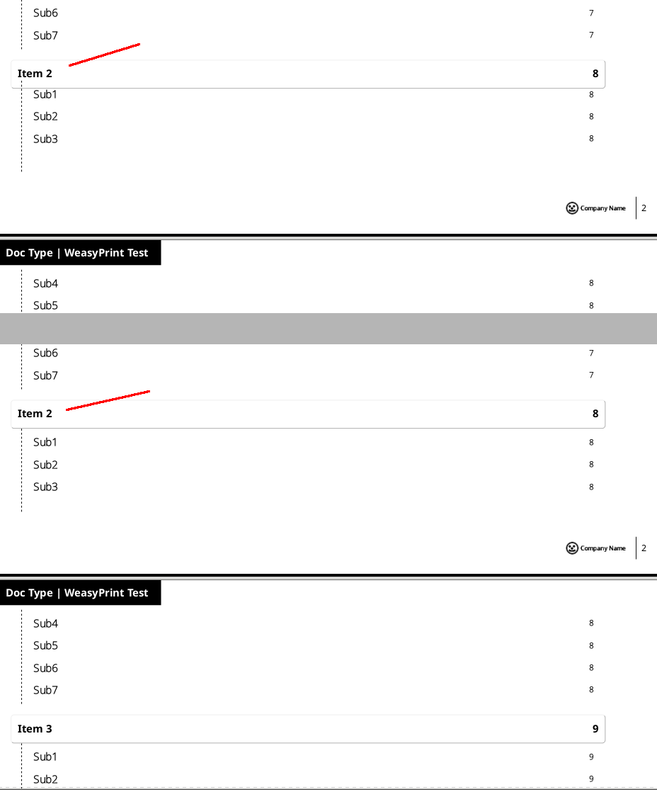

## Introduction


Markdown to PDF study guides should be painless. Making one should be like... a short walk on a long pier (vs. the other way around, which ends in wet clothes...) Here's a paragraph of gibberish, just to take up some space and demonstrate a Markdown paragraph...

Lorem ipsum dolor sit amet, consectetur adipiscing elit, sed do eiusmod tempor incididunt ut labore et dolore magna aliqua. Ut enim ad minim veniam, quis nostrud exercitation ullamco laboris nisi ut aliquip ex ea commodo consequat. Duis aute irure dolor in reprehenderit in voluptate velit esse cillum dolore eu fugiat nulla pariatur. Excepteur sint occaecat cupidatat non proident, sunt in culpa qui officia deserunt mollit anim id est laborum.

That's a shot of Craig's wife and one of his sons at Myrtle Beach, SC, by the way...

## History

There have been a few incarnations of *Study Guide making* over the years.

### The Old Old Way


Elle (one of Linux Academy's TAs -- I think Puppet stuff has been her specialty lately) and Gibbs (one of the technical writers -- she specialities and awesomes all over the place on a pretty regular basis) used to convert the Markdown files to PDFs. There was an initial conversion from Markdown to ICML (using a `pandoc` command), then another step to PDF. That second hop was done using Adobe InDesign (IMCL is an InDesign file format). But when there was an error found in the Markdown text, and a change had to be made, then any work done so far on the layout (in the ICML) was lost. This meant some study guides took a week or two. I was only looking at it from afar, but it was ugly.

This is a picture of what happens when Craig misses his driveway in January, by the way...

### The New Old Way

Using another `pandoc` command, and a LaTeX template, there was no monkeying around in InDesign. We ran the command, and BAM. A few seconds later, there was a nice looking PDF. But it was only sort of nice looking. Issues with the template (and Craig's lack of LaTeX experience, coupled with a *I'm never going to use this anywhere else, so there's not much sense wasting time figuring it out* attitude) meant that it would never measure up to what the Design department was looking for.

### The New Way

Craig doesn't know LaTeX, but he ***does*** have half a clue in the CSS department. This new way uses a `pandoc` command to convert Markdown to HTML (child's play -- that's what Markdown was invented for!) then runs a program called Weasyprint to get from HTML to PDF. This is way easier to style, and is spitting out almost exactly what Design called for (just, you know, six or eight months after they asked for it -- hehe) and is much nicer to look at. It also takes about the same amount of time to create the finished PDF, and isn't nearly so picky about Markdown formatting as the LaTeX route was.

## How To

This is going to be really easy. Getting the environment set up involves installing a few packages. I've (I meaning Craig -- I'm all done talking in third person now) tested on Ubuntu, and another of our fine folks (Aaron Turner) got it running on MacOS for us. But regardless of your OS, the package names should be similar. Here's how we got the environment set up on Ubuntu, and then again on a Mac.

### Installing Software

#### On Ubuntu

Grab Pandoc from Github. I started at 2.3.1, but was at 2.5.1 by the time I got done:  
```
sudo dpkg -i <DOWNLOADED PANDOC FILE>.deb
```

Get pip installed (for Python3):

```
sudo apt-get install python3-pip
```

Now install Weasyprint:

```
sudo pip3 install WeasyPrint
```

#### On a Mac

##### Homebrew  

  1. If Homebrew is ***not*** installed yet:  
     ```
     /usr/bin/ruby -e "$(curl -fsSL \  
     https://raw.githubusercontent.com/Homebrew/install/master/install)"   
     ```  

  2. If Homebrew ***is*** installed:  
     ```
     brew update
     brew install pandoc python3 cairo pango gdk-pixbuf libffi
     pip3 install WeasyPrint
     ```  


### Templates


#### Fonts

In the same directory as wherever we're running the `pandoc` command from, there needs to be a `fonts` directory, so that we can declare where to get fonts from. You don't NEED one really, but I'm trying to keep schtuff cleaned up. If we have all the fonts sitting in a directory relative to where we're running the command, we won't have to dork around with setting different font paths in the CSS stylesheet. We need NotoSans, NotoSans-Light (any H1 level headings use that one, and the only H1 we'll have is on the title page), and SourceCodePro. Use whatever fonts you like, but just make sure to call them correctly in the CSS file.

### Preparation

We need to have any images in place beforehand. This includes the title page image (Linux Academy study guides use the awesome ones that Nate Koehler is making these days). Any images that are actually used in the regular content part of the document go in the `tmpImages` directory. The one that's going to be on the cover ***must*** be renamed to `Cover_Image.png`, and ***must*** be placed in the `images` directory, not `tmpImages`. All of the other images will be fine, just make a regular markdown image link. And you're free to stick them wherever you want, I just figured it'd be easier keeping document images separate from template images.

They'll always float to the right, and regardless of how wide they are they will never take up more than half the page. They'll scale automagically. Don't include a caption -- it keeps showing up on the left and I haven't figured out how to kick it over yet. If anyone figures it out, do me a favor and let me know what you've done. I can figure it out eventually, but I need a break from this project for a bit.

I've noticed, when making PDFs, that sometimes one image will show up to the left of another image. This is kind of like in a web page: there's only so much styling you can account for, and the rest is just making sure there's enough text between images to have them bumped down to the right places. This styling is kind of set. I can hand edit HTML in the Markdown file, but I'd rather just set it and forget it. I'll deal with making sure there's enough text between them.

As far as image links go, just make them like I have them in this README, and you're golden.

<div class="pagebreak"> </div>

### Running the Command

Currently, there are two commands:

```
pandoc -s --template="templates/default.html" -f markdown-smart --toc -c style.css file.md -o file.html
python3 -m weasyprint file.html file.pdf
```

`make-it-so.sh` should run this for you, once everything is installed. First it will list out all the markdown files in the directory, and spit out their names (sans `.md` extension). You need to copy that filename into the prompt. Then it asks whether you want a Landscape or a Portrait style document. Once you pick which way you want to go, you'll be in endless loop.

Note that the `style.css` part in the command above isn't quite right. There are two stylesheets, `style-landscape.css` and `style-portrait.css`. Answering the prompt make sure the right one gets used.

The script uses Pandoc to create an HTML file based on the Markdown (with the same name, so `bob.md` will result in `bob.html`) and the correct stylesheet. Then the script runs a `weasyprint` command to get it from that `.html` file to a PDF with the same name.

I've found that since I need to run this several times while I'm creating a document (to kind of check my work as I go), it's pretty handy not having to retype commands. So the script waits when it's done building the PDF. All you need to do is hit **Enter**, and it will create a new PDF. But it won't ask you for filenames or layout. It's going to use the choices you already made, and just keep running the same commands. So all you need to do it edit Markdown, save, hit **Enter** on the script, then rinse and repeat. That's it.

Because I've discovered that I want to make the file over and over again while I'm making sure it looks good, the script will just wait for you to hit **Enter** again. Make changes to the Markdown file, hit **Enter**, and it will repeat the process on that same Markdown file, without asking for the filename again.

That's it. When it's done and looks good, you're finished. Send your PDF wherever you like. To kill the script, hit **Ctrl C**.

## The Actual Content

What follows here is just a hodgepodge of markdown to show what things will look like on the final PDF.

### The YAML Header

We need a block of YAML at the beginning of the markdown document, with the title, author, etc.
```
---
title: Markdown to PDF Conversion Test File
subtitle: A markdown file, pandoc command, LaTeX template, and resulting PDF containing all the formatting scenarios I could think of.
author: Craig Parker (Pahkah in Maine)
email: craigp@linuxacademy.com
date:  Aug 1, 2019
---
```

The only required thing there is the `title`.


### Headings

Since this method uses actual HTML and CSS, headings in Markdown translate exactly how they should. No more having to dork with LaTeX shenanigans where there are "sort of" equivalents of the different levels of headings,  and me needing to translate in the template. It's a beautiful thing. **H1** is reserved for the document title, and is styled with a lighter version of NotoSans. You can use it in the documents, but I'd planned on **H2** being the biggest header in the content. Speaking of **H2**, any of these headings will have a box around them. And ***any time*** there is an **H2** heading, it will start a new page.

### Table of Contents

This is created based on the headings. I'm still dorking with the process a bit, but for now, only **H2** and **H3** will show up in the TOC. Ingrid (Linux Academy's "rock star" content designer) was willing to let me get away with a single column TOC, but wanted two. We cut a deal. I will figure this out eventually, but for now that's the way it is. I will probably incorporate down to **H4** in the TOC once I've figured that out. Going down to **H4** now though would chew up a bunch of page real estate in single-column mode, so I'm not showing headings that far down.

You may also notice that each item in the TOC is an actual link to that spot in the document. Spiffy, eh?

<div class="pagebreak"> </div>

#### Slight Problem with the TOC



As it sits, there is a problem with the list under an H2 heading in the TOC spans across a page break. Look at the image here, and the top red line points to the problem. The list, on that page, gets bumped up a bit. The fix, to get what you see in the bottom half of the image, is a hack.

The fix is to edit `boxes.py`. You'll have to hunt for it, but it's sitting in whichever directory WeasyPrint got installed to. Something like: `/usr/local/lib/python3.6/dist-packages/weasyprint/formatting_structure` on an Ubuntu machine, and `/usr/local/lib/python3.7/site-packages/weasyprint/formatting_structure/boxes.py` on a Mac.

Line 324 of that file (but this may change in future versions) reads:
```
if (start or end) and old_style == self.style:
```

It is essentially saying *If something is equal to something else*, and we need it to say *If something is NOT equal to something else*. We do it by replacing one of those equals signs with an exclamation point, like this:
```
if (start or end) and old_style != self.style:
```

Rendering should work fine now.

## H2

This what an **H2** heading looks like. See how it started a new page?

### H3  

This is **H3**

#### H4  

This is **H4**

##### H5  

This is **H5**

###### H6  

This is **H6**

### Sidenotes

Blank lines are no longer required between things so much, like they were with the LaTeX template. I'll probably keep doing it, just because it's easier to read, but it won't trip us up like before. A blank line is ***still*** required before a bulleted list though. And speaking of lists...

## Lists

With `:::blah` ahead of a list, and `:::` after it (blank lines above and below each) we can create html divs with pandoc, and they have a class (`blah` in this case). Then we can style things for that class. So this example would create some html looking like:
```
<div class="blah">
```

Now we can style lists differently. Look at the CSS files to see, in the section about lists. Style these however you want, these just look so far like what we're going to be using here at Linux Academy. I'm all about less typing, so your default will look different than ours.

## Top Level Bold, Next Level Numbered

This is the default list style.

  - Bulleted List
  - blah
  - blah
    - There's a way to do this with things besides bullets (Roman numerals, numbers, capital and lowercase letters, numbers, etc) but I just need bullets, so here they are.
    - There is also a way to get other characters, like textopenbullet, but I haven't found a font yet that contains it. Use textbullet, and experiment from there, using the Great Big List of LaTeX Symbols I've included in the `help_stuff` directory.
  - Another point
    ```
    A code block nested in a list
    ```
    - Level 2
  - Yet another point
    - Level 2 again
    - One more Level 2, for good measure
      - Level 3
        - Level 4
          - Level 5
            - Level 6
              - Level 7
                - Level 8
                  - Level 9
  - A third point
    - Sub-bullet
      - Another one
    - Sub-bullet 2
  - A fourth point  

## Top Level Normal, Next Level Numbered

:::nob

  - Bulleted List
  - blah
  - blah
    - There's a way to do this with things besides bullets (Roman numerals, numbers, capital and lowercase letters, numbers, etc) but I just need bullets, so here they are.
    - There is also a way to get other characters, like textopenbullet, but I haven't found a font yet that contains it. Use textbullet, and experiment from there, using the Great Big List of LaTeX Symbols I've included in the `help_stuff` directory.
  - Another point
    ```
    A code block nested in a list
    ```
    - Level 2
  - Yet another point
    - Level 2 again
    - One more Level 2, for good measure
      - Level 3
        - Level 4
          - Level 5
            - Level 6
              - Level 7
                - Level 8
                  - Level 9
  - A third point
    - Sub-bullet
      - Another one
    - Sub-bullet 2
  - A fourth point  

:::

## Top Level Bold, Next Level Bulleted

:::nonum

  - Bulleted List
  - blah
  - blah
    - There's a way to do this with things besides bullets (Roman numerals, numbers, capital and lowercase letters, numbers, etc) but I just need bullets, so here they are.
    - There is also a way to get other characters, like textopenbullet, but I haven't found a font yet that contains it. Use textbullet, and experiment from there, using the Great Big List of LaTeX Symbols I've included in the `help_stuff` directory.
  - Another point
    ```
    A code block nested in a list
    ```
    - Level 2
  - Yet another point
    - Level 2 again
    - One more Level 2, for good measure
      - Level 3
        - Level 4
          - Level 5
            - Level 6
              - Level 7
                - Level 8
                  - Level 9
  - A third point
    - Sub-bullet
      - Another one
    - Sub-bullet 2
  - A fourth point  

:::

And a link will look like [this link](http://linuxacademy.com)

## Other Items We'll Run Into

This is a horizontal line:

---


> This is a block quote Lorem ipsum dolor sit amet, consectetur adipiscing elit, sed do eiusmod tempor incididunt ut labore et dolore magna aliqua.
>> And this is nested blockquote.

> More of the original quote here... Lorem ipsum dolor sit amet, consectetur adipiscing elit, sed do eiusmod tempor incididunt ut labore et dolore magna aliqua.

> ##### This is an H5 type header, inside a quote, with a quoted list under it:
>
> 1.   This is the first list item.
> 2.   This is the second list item.
>
> Here's some example code. I tend to lean toward three backticks, rather than four spaces, just because spaces can get hinkey when used in conjunction with list items that need some indentation:
> ```
> return shell_exec("echo $input | $markdown_script");
> ```
>


### Code Blocks

Code blocks have never really been a problem, but Pandoc uses GitHub flavored markdown, meaning that we can now label a code block with a language if we want, and we'll get pretty colors:

<table>
<tr><td> Python </td><td> Bash </td>
<tr>
 <td>
```python
radius = 10
circumference = 2 * np.pi * radius
circumference
```
</td>
<td>

```bash
radius = 10
circumference = 2 * np.pi * radius
circumference
```
</td>
</tr>
</table>

### Tables

Oh my word... Straight up Markdown tables work now. No LaTeX tinkering required. How's that 80's commercial go... *Calgon, take me away...*

| **Password** | **Base** | **Length** | **Combinations** |
|--------|------|------|------|
| password | a-z 26 | 8 | 208,827,064,576 |
| Password | a-z,A-Z  52 | 8 | 53,459,728,531,456 |
| Passw0rd | a-z,A-Z,0-9 62 | 8 | 218,340,105,584,896 |
| P@ssw0rd | a-z,A-Z,0-9,@ 94 | 8 | 6,095,689,385,410,816   |
| P@s5 | a-z,A-Z,0-9,@ 94 | 4 | 78,074,896   |

### Page Breaks

To force page breaks, I've included a CSS class. When we need to do a page break, just type some raw HTML:
```
<div class="pagebreak"> </div>
```

To see how this works, take a peek at the raw Markdown, just above the **### Running the Command** heading. I did it up there. You'll see in the PDF that there's a break right before that heading.

## The CSS

I'm not going to post the whole sheets here, but point out a few things that may help you customize them.

As mentioned before, there are two stylesheets: `style-landscape.css` and `style-portrait.css`. When you make changes in one, be sure to do the equivalent in the other.

### Pages

Right up near the top of the page, I declare fonts. We use Noto Sans and Source Code Pro at Linux Academy, but feel free to plug in any fonts you want there. Grab the regular, bold, and italic version of each. Just put them in the same directory that I stuck ours in, and refer to them like I did.

Below that, you’ll see a `@page :first`. This is the cover page. I’ve declared a background image, and in the example PDF, that’s a Pinehead stuffy in the middle of the Kancamagus Highway in New Hampshire. Note the image size, 450×300. If you want a different sized image, you’ll have to dork with the margins. Play with it until it sits where you want it to, then you should probably stick with the same size images, moving forward. If you don’t, you’ll be messing with margins every time you make a PDF.

Next in line is `@page no-chapter`. This is the table of contents page. I’ve got things set up pretty much the same as on the regular pages. But you can change them here (get rid of the logo and page number in the lower right maybe) and not affect the rest of the document.

Up next is the `@page`. This affects anything after the Table of Contents page(s) in the PDF. It’s pretty much the same as the TOC page, but the opportunity is there to make things a little different.

Finally, there’s `@page :blank`. To tell you the truth, I can’t actually remember what this is for. Remember though, I was on a marathon *this needs to get done FAST* kind of mission, so some of it is a blur. I apologize... Suffice to say that if I can’t remember, you’re probably all set not knowing too.

### The Rest

If you know anything about CSS, the remainder of the stylesheet should make perfect sense. One thing you may wonder about is the actual title on the title page. This is a bit of a lighter font. If you like it, do what I did: declare a lighter font-face, make sure the lighter font is in the fonts directory, then call it like I did in my `h1.title` declaration. Or just leave it alone.

I mentioned the lists already, just look for the line like this in the stylesheets:
```
/* ------------------- Lists --------------------------*/
```

You'll see what's going on and should be able to figure out what you want to get done.

## The HTML

There really isn’t a whole lot else to mess with. In the `templates` directory, there’s a `default.html` file there where I customized what’s showing up. I’ve got **title**, **subtitle**, **author**, **email**, and **date**, and you can see where those are showing up on the finished PDF. This is where you can edit them though, if you want something different showing up on your cover page.


## Conclusion

So, welcome to the **New Way**. It should make life a lot easier for everyone moving forward. So long, and thanks for all the fish!
